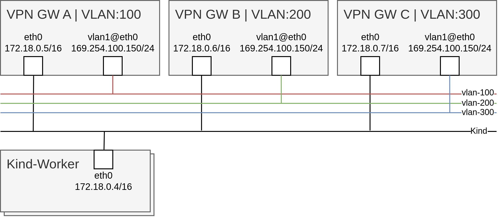
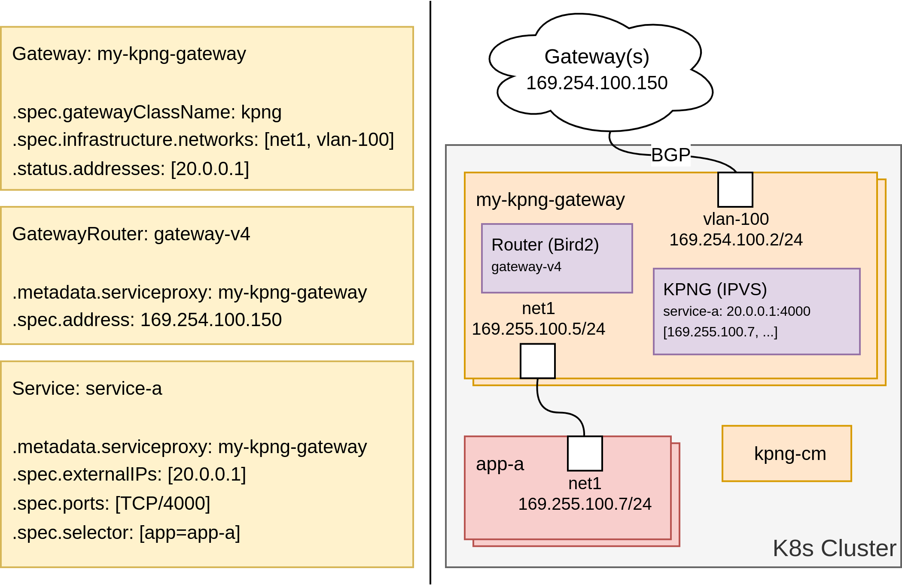

# Layer 3/4 Gateway API PoC

This is a PoC (Proof Of Concept) for layer 3 / 4 services using Gateway API (v1.1.0) over secondary networks in Kubernetes (v1.30).

Build
```
make generate
make REGISTRY=ghcr.io/lioneljouin/l-3-4-gateway-api-poc
```

### pre-requisites:

Create Kind cluster:
```
kind create cluster --config hack/kind.yaml
```

Install Gateway API:
```
kubectl apply -k https://github.com/kubernetes-sigs/gateway-api/config/crd/experimental?ref=v1.1.0
```

Install Multus:
```
helm install multus ./deployments/Multus --set registry=ghcr.io/lioneljouin/l-3-4-gateway-api-poc
```

Install Gateways/Routers/Traffic-Generators (`docker compose down` to uninstall. Change manually the image in `docker-compose.yaml` if you built your own):
```
docker compose up -d
```

The gateway-routers containers are running outside of the Kind cluster and are connected to the kind network. Each container has a vlan interface on top of the primary network. These containers are used to separate networks and generate traffic on different networks using the same service IP. Bird2 is running and listening in the vpn containers, once the service IPs are advertised via BGP, traffic can be send.


## PoC 1: Service as Gateway API Route using [KPNG](https://github.com/kubernetes-sigs/kpng)

### Installation

Install the KPNG controller manager:
```
helm install poc ./deployments/PoC --set registry=ghcr.io/lioneljouin/l-3-4-gateway-api-poc
```

Install the example kpng Gateway/GatewayRouter/Service:
```
kubectl apply -f examples/kpng-gateway-api.yaml
```

Install example application behind the service:
```
helm install example-target-application-a ./examples/target-application/deployment/helm --set applicationName=a --set registry=ghcr.io/lioneljouin/l-3-4-gateway-api-poc
```

Send traffic (400 TCP connections to 20.0.0.1:4000)
```
docker exec -it vpn-a mconnect -address 20.0.0.1:4000 -nconn 400 -timeout 2s
```

### How does it work?

- The KPNG Controller Manager (kpng-cm) reconciles the Gateways of KPNG class by:
    1. Creating the daemonset corresponding to the Gateway.
    2. Finding all services that belong to the Gateway to:
        - Fetch all external IPs (VIPs) and add them to the Gateway status.
        - Fetch all pods selected by these services and create the corresponding endpointslices. Pods are added to the EndpointSlice only if an IP can be found. An IP can be found if the network status annotation contains one of the networks configured in the Gateway network annotation.
- The Router reconciles the Gateway by finding all GatewayRouters and fetching the addresses in the Gateway status to configure Bird accordingly.


