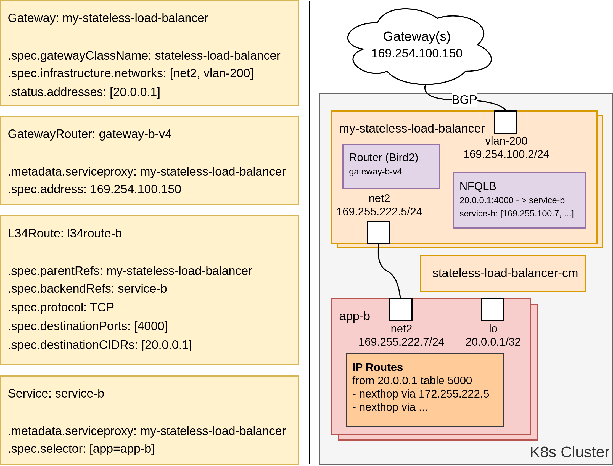
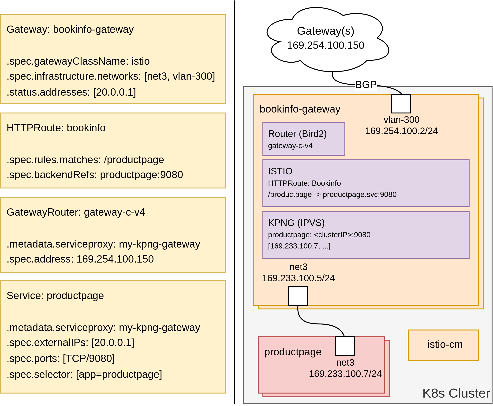

# Layer 3/4 Gateway API PoC

This is a PoC (Proof Of Concept) for layer 3 / 4 services using Gateway API (v1.1.0) over secondary networks in Kubernetes (v1.30).

* [PoC 1: Service as Gateway API Route using KPNG](#poc-1-service-as-gateway-api-route-using-kpng)
* [PoC 2: A Stateless-LB No NAT (NFQLB) using Layer 3/4 routes](#poc-2-a-stateless-lb-no-nat-nfqlb-using-layer-34-routes)
* [PoC 3: Istio gateway with a KPNG and a router container as sidecars](#poc-3-istio-gateway-with-a-kpng-and-a-router-container-as-sidecars)
* [Conclusion](#conclusion)

Controllers must be re-written to be fully functional. They are currently written only to make the demos to work.

### Build

This builds, tags and pushes
```
make generate
make REGISTRY=ghcr.io/lioneljouin/l-3-4-gateway-api-poc
```

### pre-requisites:

Create Kind cluster:
```
kind create cluster --config hack/kind.yaml
```

Install Gateway API:
```
kubectl apply -k https://github.com/kubernetes-sigs/gateway-api/config/crd/experimental?ref=v1.1.0
```

Install Multus:
```
helm install multus ./deployments/Multus --set registry=ghcr.io/lioneljouin/l-3-4-gateway-api-poc
```

Install cert-manager
```
kubectl apply -f https://github.com/cert-manager/cert-manager/releases/download/v1.14.5/cert-manager.yaml
```

Install Gateways/Routers/Traffic-Generators (`docker compose down` to uninstall. Change manually the image in `docker-compose.yaml` if you built your own):
```
docker compose up -d
```

The gateway-routers containers are running outside of the Kind cluster and are connected to the kind network. Each container has a vlan interface on top of the primary network. These containers are used to separate networks and generate traffic on different networks using the same service IP. Bird2 is running and listening in the vpn containers, once the service IPs are advertised via BGP, traffic can be send.


Install the l-3-4-gateway-api-poc controller managers:
```
helm install poc ./deployments/PoC --set registry=ghcr.io/lioneljouin/l-3-4-gateway-api-poc
```

## PoC 1: Service as Gateway API Route using [KPNG](https://github.com/kubernetes-sigs/kpng)

Configuration: [examples/kpng-gateway-api.yaml](examples/kpng-gateway-api.yaml)

### Installation

Install the example kpng Gateway/GatewayRouter/Service:
```
kubectl apply -f examples/kpng-gateway-api.yaml
```

Install example application behind the service:
```
helm install example-target-application-a ./examples/target-application/deployment/helm --set applicationName=a --set registry=ghcr.io/lioneljouin/l-3-4-gateway-api-poc
```

Send traffic (400 TCP connections to 20.0.0.1:4000)
```
docker exec -it vpn-a mconnect -address 20.0.0.1:4000 -nconn 400 -timeout 2s
```

### How does it work?

- The KPNG Controller Manager (kpng-cm) reconciles the Gateways of KPNG class by:
    1. Creating the daemonset corresponding to the Gateway.
    2. Finding all services that belong to the Gateway to:
        - Fetch all external IPs (VIPs) and add them to the Gateway status.
        - Fetch all pods selected by these services and create the corresponding endpointslices. Pods are added to the EndpointSlice only if an IP can be found. An IP can be found if the network status annotation contains the networks configured in the Gateway network annotation (`l-3-4-gateway-api-poc/networks`).
- The Router reconciles the Gateway by finding all GatewayRouters and fetching the addresses in the Gateway status to configure Bird accordingly.


## PoC 2: A Stateless-LB No NAT ([NFQLB](https://github.com/Nordix/nfqueue-loadbalancer)) using Layer 3/4 routes

Configuration: [examples/stateless-load-balancer-gateway-api.yaml](examples/stateless-load-balancer-gateway-api.yaml)

Install the example stateless-load-balancer Gateway/GatewayRouter/Service:
```
kubectl apply -f examples/stateless-load-balancer-gateway-api.yaml
```

Install example application behind the service:
```
helm install example-target-application-b ./examples/target-application/deployment/helm --values ./examples/applications-values/b.yaml --set applicationName=b --set registry=ghcr.io/lioneljouin/l-3-4-gateway-api-poc
```

Send traffic (400 TCP connections to 20.0.0.1:4000)
```
docker exec -it vpn-b mconnect -address 20.0.0.1:4000 -nconn 400 -timeout 2s
```

Update L34Route (Adds to 40.0.0.1 service IP)
```
kubectl apply -f examples/stateless-load-balancer-gateway-api-update.yaml
```

Send traffic (400 TCP connections to 40.0.0.1:4000)
```
docker exec -it vpn-b mconnect -address 40.0.0.1:4000 -nconn 400 -timeout 2s
```

### How does it work?

- The Stateless-load-balancer-controller-manager reconciles the gateways of Stateless-load-balancer class by:
    1. Creating the deployment corresponding to the Gateway.
    2. Finding all services that belong to the Gateway to:
        - Fetch all external IPs (VIPs) and add them to the Gateway status.
        - Fetch all pods selected by these services and create the corresponding endpointslices. Pods are added to the EndpointSlice only if an IP can be found. An IP can be found if the network status annotation contains the networks configured in the Gateway network annotation (`l-3-4-gateway-api-poc/networks`). It also assign a unique identifier to each endpoint in the endpointslice (required by NFQLB).
- The Stateless-load-balancer-controller-manager reconciles the pods by:
    1. Finding all services the pod is serving.
    2. Adding network configuration (VIP and Source Based Routing) to the Pod by updating the pod annotation ([multus-dynamic-networks-controller](https://github.com/k8snetworkplumbingwg/multus-dynamic-networks-controller) will reconciles them and Multus will call CNIs)
- The Stateless-load-balancer reconciles the gateways of Stateless-load-balancer class by getting services, endpointslices and L34Routes to configure NFQLB accordingly.
- The Router reconciles the Gateway by finding all GatewayRouters and fetching the addresses in the Gateway status to configure Bird accordingly.



## PoC 3: Istio gateway with a KPNG and a router container as sidecars

https://istio.io/latest/docs/setup/additional-setup/getting-started/

Install istioctl
```
curl -sL https://istio.io/downloadIstioctl | sh -
```

Install istio
```
istioctl install -f examples/istio/demo-profile-no-gateways.yaml -y
kubectl label namespace default istio-injection=enabled
```

Install istio gateway/Route
```
kubectl apply -f examples/istio/bookinfo-gateway.yaml
```

Install istio demo application
```
kubectl apply -f examples/istio/bookinfo.yaml
```

Run traffic
```
docker exec -it vpn-c curl 20.0.0.1/productpage
```

### How does it work?

It works in the same way as PoC 1 with istio router running in front of KPNG. The service type load-balancer created by Istio when creating the Gateway is not in use here. Instead, as in PoC 1, the external IPs of the service served in the KPNG is advertised via BGP.



### Conclusion 

TBD